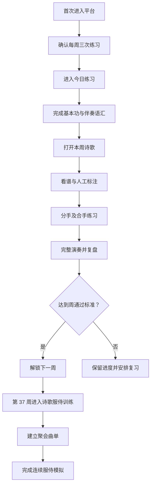

# 诗琴产品需求文档

## 1. 产品概述

“诗琴”是一套面向成人初学者的本地优先钢琴学习平台。它以现有《练琴学习计划》为基本功主线，以 `/选本诗歌712/歌谱` 的 712 个编号、747 份歌谱图片为服侍曲库，把“会弹简单曲目”继续推进到“能在聚会中稳定双手司琴”。

产品不承诺学员逐首背完 712 首诗歌。课程训练的是可迁移能力：看调、定手位、设计指法、识别和弦、选择伴奏型、保持会众可跟随的速度，以及在短时间内预备陌生诗歌。

### 1.1 资料基线

| 资料 | 当前状态 | 产品用途 |
| --- | --- | --- |
| 小汤 1、2 | 原 PDF、30 份候选 MusicXML、OCR 和候选指法 | 第 1—8 周手指、手位和最小双手训练 |
| 拜厄 | 原 PDF、170 份候选 MusicXML | 第 9—36 周系统基本功 |
| 哈农 | 原 PDF、68 份候选 MusicXML，均待审核 | 第 13 周后短时技术辅助 |
| 选本诗歌 712 | 712 个编号、747 张 JPG，其中 35 个第二调版本 | 曲库浏览、服侍预备、曲单和阶段考核 |
| 现有产品/技术文档 | 已定义 36 周基本功、简谱渲染和 OMR 门禁 | 新平台的教学与工程约束 |

候选 MusicXML 不等于正式乐谱。未经人工审核的 OMR 结果不得用于逐音判错、自动播放或自动生成指法。

## 2. 用户与成果

### 2.1 首发用户

- 会读常见简谱，具备基本节奏、拍号和调号知识。
- 可以单手弹奏《欢乐颂》或同等难度旋律。
- 有电钢琴或钢琴，每周练习 3 次，每次约 60 分钟。
- 目标是在小组、家庭聚会或教会聚会中承担基础诗歌伴奏。

### 2.2 结业能力

课程共 48 周。前 36 周建立双手、调性、和弦和视奏基础；后 12 周专门训练诗歌服侍。

结业学员应能够：

1. 读懂常见简谱中的调号、拍号、反复、弱起和基本节奏。
2. 在 C、G、F、D、A、降 B 大调及相关小调中快速找到主音与常用和弦。
3. 根据诗歌曲风选择柱式、低音加和弦、分解和弦、八度低音等基础伴奏型。
4. 右手保持旋律清楚，左手持续伴奏，少量错音时不停止。
5. 使用前奏、间奏、尾奏和结束手势支持领诗者与会众。
6. 根据会众音域把已学伴奏移到相邻常用调；首版平台记录移调任务，但不伪造图片自动移调。
7. 在 20—40 分钟内完成一首普通难度陌生诗歌的基础预备。
8. 连续完成 3—5 首聚会曲单，保持速度、段落和结束一致。

### 2.3 “大部分诗歌可服侍”的验收定义

“大部分”指选本中旋律、节奏与和声属于常见会众诗歌写法的曲目，不包括复杂转调、快速装饰、密集复调或需要专业编配的少数曲目。

结业考核采用抽样而非背诵：

- 从未专门练过的普通难度诗歌中随机抽取 10 首。
- 10 分钟内能完成调性、拍号、段落、起止和难点标注。
- 其中至少 8 首能以基础伴奏型从头连续弹完。
- 至少 6 首能加入合宜的前奏和尾奏。
- 另完成一组 3 首连续聚会模拟，段落、速度和结束无中断性错误。

## 3. 课程体系

### 3.1 八个阶段

| 阶段 | 周次 | 目标 | 主要材料 |
| --- | --- | --- | --- |
| 1. 手指与手位 | 1—4 | 指号、中央 C、C 五指位、最小双手 | 小汤 1、极短简谱 |
| 2. 基础双手 | 5—8 | C/F/G 和弦、低音加和弦 | 小汤 2、简单诗歌片段 |
| 3. 左右手独立 | 9—12 | 分解和弦、连续八分音符、换位 | 拜厄 7—17 页 |
| 4. 调性扩展 | 13—20 | C/G/F/D 与相关小调、转位、6/8 | 拜厄、少量哈农 |
| 5. 简谱双手 | 21—28 | 看简谱组织旋律与左手伴奏 | 拜厄、每周新谱 |
| 6. 完整演奏 | 29—36 | 连续性、层次、踏板、32 小节视奏 | 拜厄、完整曲目 |
| 7. 诗歌伴奏 | 37—42 | 四类伴奏型、前奏/间奏/尾奏、移调 | 选本诗歌代表曲 |
| 8. 聚会服侍 | 43—48 | 领诗配合、曲单预备、现场恢复、模拟服侍 | 选本诗歌曲单 |

### 3.2 每周三次练习

每周安排“学习、连接、服侍模拟”三次练习，每次约 60 分钟：

| 练习项 | 时长 | 内容 |
| --- | ---: | --- |
| 放松与热身 | 5 分钟 | 坐姿、手型、五指或音阶 |
| 方法与技术 | 15 分钟 | 小汤、拜厄、和弦转位或短时哈农 |
| 伴奏语汇 | 15 分钟 | 当前调性的和弦与伴奏型 |
| 主练诗歌 | 15 分钟 | 分手、难点、完整连接 |
| 视奏/服侍模拟 | 10 分钟 | 陌生诗歌、前奏尾奏或连续曲单 |

第 1—36 周仍以现有学习计划规定的教材比例为准；第 37 周后方法教材降为维护，服侍训练成为主线。

### 3.3 诗歌训练模板

每首训练诗歌都按统一步骤进行：

1. 看谱：确认编号、调号、拍号、速度、弱起、反复与段落。
2. 唱谱：找主音、结束音、重复句和旋律最高最低音。
3. 定位：设置右手起始手位，圈出扩指、穿指、跨指或换指。
4. 和声：标出已有和弦；没有可靠和弦时由用户人工记录，不自动猜测为事实。
5. 分手：右手唱旋律，左手只弹根音或和弦。
6. 合手：从低速完成主歌或第一段，再连接全曲。
7. 服侍化：加入一段前奏、段间衔接与明确尾奏。
8. 模拟：不因小错停下，跟随虚拟领诗提示完成全曲。
9. 复盘：记录速度、调性、伴奏型、易错位置和下次目标。

## 4. 核心功能

### 4.1 今日练习

- 显示当前阶段、周次、练习日和结业目标。
- 展示 5 个练习项、预计时长、完成状态和当前应做项目。
- 一键继续上次未完成练习。
- 显示连续练习天数、本周分钟数和服侍预备进度。

### 4.2 48 周课程路径

- 展示 8 个阶段、48 周、每周 3 次练习。
- 周卡显示能力目标、教材、诗歌任务和通过标准。
- 支持复习已完成内容；未通过时不强制解锁下一阶段。
- 每阶段末有可记录的技能考核。

### 4.3 选本诗歌曲库

- 从本地文件名生成 712 个编号、747 个版本的目录。
- 支持按编号和标题搜索。
- 明确显示原调/第二调版本，不把变体当作新编号。
- 支持收藏、最近练习和“加入服侍曲单”。
- 大图查看、缩放、旋转和全屏；图片加载失败时显示文件名与恢复建议。
- 曲目难度、调性、拍号、和弦与服侍分类只能由人工标注或可靠结构化数据提供。

### 4.4 诗歌练习台

- 左侧显示歌谱，右侧显示训练步骤、计时器、节拍器和练习笔记。
- 支持记录练习调、目标速度、伴奏型、段落难点和前奏/尾奏状态。
- 支持分手、合手、完整演奏、聚会模拟四种模式。
- 提供 Web MIDI 连接状态；没有 MIDI 时课程仍可计时和完成。
- 不保存 MIDI 原始事件。

### 4.5 服侍曲单

- 创建一次聚会曲单，加入、移除和调整诗歌顺序。
- 为每首歌记录实际使用调、起拍提示、速度、领诗备注和衔接方式。
- 提供“聚会模拟”：按顺序打开歌谱并计时，检查换歌准备时间。
- 曲单与备注只保存在当前浏览器，可导出/导入 JSON 备份。

### 4.6 练习记录

- 显示周练习时长、完成课次、已练诗歌和最近服侍曲单。
- 每次记录一个具体问题与下次目标。
- 以“连续性、节拍、左手稳定、旋律清楚、段落配合”五项自评。
- 可以清除本地记录，但必须二次确认。

## 5. 核心流程

## 6. 页面设计

### 6.1 信息架构

| 页面 | 核心模块 |
| --- | --- |
| 今日 | 今日课表、周进度、继续练习、近期诗歌 |
| 课程 | 8 阶段路径、48 周卡片、阶段考核 |
| 诗歌 | 搜索、编号目录、收藏、歌谱查看 |
| 练习台 | 歌谱、步骤、计时、节拍器、笔记、MIDI |
| 曲单 | 聚会顺序、调性/速度/起拍备注、模拟 |
| 记录 | 练习统计、能力自评、最近问题 |

### 6.2 视觉方向

- 方向：安静、专注的“诗本与琴房”，采用编辑式纸面排版，不做游戏化霓虹界面。
- 主色：香柏绿 `#1F5548`；深墨 `#18231F`；暖纸 `#F5F0E5`；琥珀 `#D9863D`。
- 标题使用宋体风格，正文使用清晰的中文黑体；不依赖远程字体。
- 圆角控制在 6—12px，低阴影，不使用紫色渐变。
- 进度和状态同时使用文字、图形、边框和颜色表达。
- 桌面优先；在手机上导航变为底部栏，练习台改为歌谱与控制区上下排列。
- 所有触控目标至少 44px，支持键盘焦点和 `prefers-reduced-motion`。

## 7. 首版范围

首版必须直接可运行，包含：

- 48 周课程骨架与完整阶段目标。
- 今日练习、课程路径、诗歌曲库、练习台、服侍曲单和记录页。
- 747 张本地歌谱的目录、搜索和查看。
- 本地收藏、进度、曲单、练习记录和 JSON 备份。
- 计时器、可调节拍器和 Web MIDI 连接检测。
- 桌面与移动端适配。

首版不包含：

- 从 JPG 自动生成可信音符、和弦或指法。
- 图片谱自动移调。
- 未审核 MusicXML 的播放与逐音判定。
- 账号、云同步、付费、公开分享或多人协作。

## 8. 验收标准

### 8.1 功能

- 首次打开 3 分钟内可开始第一项练习。
- 712 个编号和全部 747 个图片版本均可搜索；35 个第二调版本有清晰标识。
- 收藏、进度、曲单和练习记录刷新后保留。
- 可创建至少 3 首诗歌的曲单并完成顺序模拟。
- 节拍器可在 40—160 BPM 运行、暂停和变速。
- MIDI 不支持或拒绝授权时，不影响手动练习。
- 没有可靠结构化乐谱时，界面不会显示自动判定结论。

### 8.2 教学

- 每周三次练习都有明确目标、材料、时长和通过标准。
- 第 1—36 周遵守现有小汤、拜厄与哈农使用边界。
- 第 37—48 周覆盖伴奏型、移调、前奏、尾奏、领诗配合和曲单模拟。
- 每首诗歌练习都能记录调性、速度、伴奏型、难点和下次目标。
- 结业页显示抽样考核规则，不以“完成进度条”代替服侍能力。

### 8.3 质量与隐私

- `npm test`、`npm run build` 通过。
- 关键页面无横向溢出，键盘可操作，状态不只依赖颜色。
- 不请求远程图片、远程字体或第三方运行时服务。
- 不上传歌谱、练习记录、MIDI 事件或设备名称。

