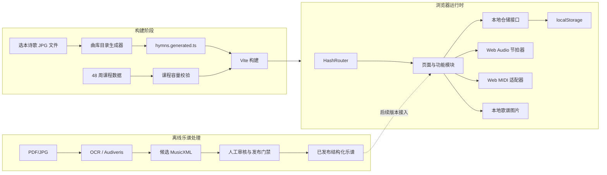

# 诗琴技术架构文档

## 1. 架构定位

当前工作区没有可运行的前端源码、`package.json` 或数据库；已有文档中“当前应用已经是 React SPA”的描述与本目录实际状态不一致。本项目按绿地应用实施，现有教材、MusicXML、OCR 和歌谱图片作为输入资产，不假定旧应用代码存在。

首版采用本地优先单页应用。目标是先完成稳定的课程、曲库、练习与服侍曲单闭环；候选 OMR 和图片谱的结构化处理保持独立，不能阻塞学习平台。

## 2. 总体架构



## 3. 技术选型

| 层 | 选型 | 原因 |
| --- | --- | --- |
| 前端 | React 18 + TypeScript | 组件化、类型约束、适合练习状态机 |
| 构建 | Vite | 绿地项目初始化简单，支持静态资源与测试 |
| 路由 | React Router 6 `HashRouter` | 静态部署无需服务器重写 |
| 样式 | 原生 CSS + CSS 变量 | 精确控制纸面视觉，减少运行依赖 |
| 图标 | Lucide React | 统一 SVG 图标，不使用表情字符代替功能图标 |
| 持久化 | `localStorage` + 版本化仓储 | 首版离线可用、无需账号 |
| 节拍器 | Web Audio API | 低依赖、可调 BPM、页面内运行 |
| MIDI | Web MIDI API | 只检测设备和会话输入，不保存原始事件 |
| 测试 | Vitest + Testing Library | 课程、仓储、组件与交互测试 |

首版不引入后端、数据库、远程字体、远程图片或分析 SDK。

## 4. 目录设计

```text
better-panio/
├── index.html
├── package.json
├── tsconfig.json
├── vite.config.ts
├── scripts/
│   └── generate-hymn-catalog.mjs
├── src/
│   ├── app/
│   │   ├── App.tsx
│   │   ├── routes.tsx
│   │   └── AppShell.tsx
│   ├── components/
│   │   ├── BrandMark.tsx
│   │   ├── EmptyState.tsx
│   │   ├── Metric.tsx
│   │   └── ProgressRing.tsx
│   ├── data/
│   │   ├── curriculum.ts
│   │   └── hymns.generated.ts
│   ├── features/
│   │   ├── curriculum/
│   │   ├── hymns/
│   │   ├── metronome/
│   │   ├── midi/
│   │   ├── practice/
│   │   ├── progress/
│   │   └── service-set/
│   ├── pages/
│   │   ├── DashboardPage.tsx
│   │   ├── CoursePage.tsx
│   │   ├── HymnLibraryPage.tsx
│   │   ├── PracticePage.tsx
│   │   ├── ServiceSetPage.tsx
│   │   └── RecordsPage.tsx
│   ├── styles/
│   │   ├── tokens.css
│   │   ├── global.css
│   │   └── components.css
│   ├── test/
│   │   └── setup.ts
│   ├── main.tsx
│   └── vite-env.d.ts
└── 选本诗歌712/
    └── 歌谱/*.jpg
```

`vite.config.ts` 将 `选本诗歌712` 配置为 `publicDir`。开发时直接从现有目录读取图片，构建时复制为静态资源；不再生成第二份源资产。

## 5. 路由

| 路由 | 页面 | 用途 |
| --- | --- | --- |
| `/` | 今日练习 | 当前周、练习项与继续入口 |
| `/course` | 课程路径 | 8 阶段、48 周与考核 |
| `/hymns` | 诗歌曲库 | 搜索 712 个编号和 747 个版本 |
| `/practice/:hymnKey` | 诗歌练习台 | 歌谱、计时、节拍器与笔记 |
| `/service-set` | 服侍曲单 | 曲单编排与聚会模拟 |
| `/records` | 练习记录 | 时长、能力自评与近期问题 |

无效 `hymnKey` 返回带“回到曲库”操作的空状态，不静默跳转。

## 6. 数据模型

### 6.1 诗歌目录

构建脚本只从文件名提取可证明的信息：

```ts
export interface hymn_catalog_item {
  key: string;
  number: number;
  variant: "" | string;
  title: string;
  filename: string;
  image_url: string;
  is_alternate_tune: boolean;
}
```

文件名解析规则：

```text
118 神的儿子亲爱救主.jpg
118b 神的儿子亲爱救主(第二调).jpg
```

解析结果分别为：

```ts
{ number: 118, variant: "", is_alternate_tune: false }
{ number: 118, variant: "b", is_alternate_tune: true }
```

脚本必须验证：

- 基础编号恰好覆盖 `1..712`。
- 总图片数为 747。
- 第二调变体数为 35。
- `key` 唯一。
- 文件名不符合规则时构建失败并列出文件。

调性、拍号、难度和服侍分类不从标题猜测。

### 6.2 课程

```ts
export type practice_kind =
  | "warmup"
  | "method"
  | "accompaniment"
  | "repertoire"
  | "sight_reading"
  | "service_simulation";

export interface practice_task {
  id: string;
  kind: practice_kind;
  title: string;
  minutes: number;
  objective: string;
  completion_criteria: string[];
  suggested_hymn_numbers?: number[];
}

export interface practice_day {
  id: string;
  week: number;
  day: 1 | 2 | 3;
  focus: "学习" | "连接" | "服侍模拟";
  tasks: practice_task[];
}

export interface curriculum_week {
  week: number;
  phase_id: string;
  title: string;
  capability: string;
  materials: string[];
  pass_criteria: string[];
  days: practice_day[];
}
```

容量校验要求：

- 周次连续为 1—48。
- 每周恰好 3 个练习日。
- 每个练习日总时长为 55—65 分钟。
- 每日包含热身、技术/方法、伴奏、曲目和视奏或模拟。
- 第 1—12 周默认不包含哈农。
- 第 13 周后哈农不超过 5 分钟。
- 第 37—48 周必须包含服侍模拟任务。

### 6.3 本地进度

```ts
export interface task_completion {
  task_id: string;
  completed_at: string;
}

export interface learning_progress {
  schema_version: 1;
  current_week: number;
  current_day: 1 | 2 | 3;
  completed_tasks: task_completion[];
  favorite_hymn_keys: string[];
  recent_hymn_keys: string[];
}
```

### 6.4 练习记录

```ts
export type accompaniment_pattern =
  | "block_chords"
  | "bass_chord"
  | "broken_chord"
  | "octave_bass"
  | "custom";

export interface hymn_practice_record {
  id: string;
  hymn_key: string;
  started_at: string;
  duration_seconds: number;
  practice_key: string;
  target_bpm: number;
  pattern: accompaniment_pattern;
  mode: "right_hand" | "left_hand" | "hands_together" | "service";
  intro_ready: boolean;
  ending_ready: boolean;
  self_rating: {
    continuity: 1 | 2 | 3 | 4 | 5;
    pulse: 1 | 2 | 3 | 4 | 5;
    left_hand: 1 | 2 | 3 | 4 | 5;
    melody: 1 | 2 | 3 | 4 | 5;
    leadership: 1 | 2 | 3 | 4 | 5;
  };
  issue: string;
  next_goal: string;
}
```

### 6.5 服侍曲单

```ts
export interface service_set_item {
  id: string;
  hymn_key: string;
  position: number;
  practice_key: string;
  bpm: number;
  count_in: string;
  transition_note: string;
}

export interface service_set {
  schema_version: 1;
  id: string;
  title: string;
  scheduled_for?: string;
  items: service_set_item[];
  updated_at: string;
}
```

## 7. 状态与仓储

业务组件不直接散落调用 `localStorage`，统一通过仓储：

```ts
interface progress_repository {
  load(): learning_progress;
  save(progress: learning_progress): void;
}

interface practice_repository {
  list(): hymn_practice_record[];
  add(record: hymn_practice_record): void;
}

interface service_set_repository {
  load(): service_set;
  save(value: service_set): void;
  export(): string;
  import(serialized: string): service_set;
}
```

存储键：

```text
shiqin.progress.v1
shiqin.practice-records.v1
shiqin.service-set.v1
```

读取到损坏 JSON 时使用安全默认值，并在界面显示可恢复提示；不得因单条记录损坏使应用白屏。

## 8. 运行时模块边界

| 模块 | 职责 | 禁止事项 |
| --- | --- | --- |
| `curriculum` | 课程数据、容量校验、解锁计算 | 不读取 DOM 或图片 |
| `hymns` | 目录搜索、变体分组、图片 URL | 不猜测调性与和弦 |
| `practice` | 计时、表单、记录生成 | 不直接写 `localStorage` |
| `metronome` | Web Audio 调度、BPM 与拍号 | 不拥有课程进度 |
| `midi` | 权限、设备状态、会话音符计数 | 不持久化原始事件 |
| `service-set` | 排序、备注、导入导出 | 不修改曲库源数据 |
| `progress` | 仓储、迁移与统计 | 不决定教学内容 |

## 9. 节拍器与 MIDI

### 9.1 节拍器

节拍器使用短时 Web Audio 振荡器，并以约 100ms 的前瞻窗口调度点击，避免只用 `setInterval` 直接发声产生明显漂移。

- BPM 范围：40—160。
- 拍号：2/4、3/4、4/4、6/8。
- 第一拍使用不同音高与视觉标记。
- 页面隐藏时停止，返回后由用户重新开始。
- 组件卸载时关闭定时器和 AudioContext。

### 9.2 MIDI

```ts
export interface midi_status {
  supported: boolean;
  permission: "idle" | "requesting" | "granted" | "denied";
  devices: Array<{ id: string; name: string }>;
  active_notes: number[];
}
```

首版只显示支持情况、设备名和当前按键，不对图片谱进行逐音判定。`note_on`/`note_off` 仅存在于内存，会话结束即清除。

## 10. 歌谱资产策略

- `选本诗歌712/歌谱` 是首版歌谱事实源。
- 构建脚本生成目录，不改名、不压缩、不覆盖原图。
- 列表页不预加载 747 张原图，只在可见卡片显示纸面封面框；打开练习台后加载目标图片。
- 练习台使用原生图片缩放与 `transform`，范围 50%—250%。
- 所有图片仅用于本地学习。公开部署前需单独确认版权与授权。

未来结构化歌谱接入必须经过：

```text
JPG/PDF
→ OCR/OMR 候选
→ 结构与时值校验
→ 原图视觉核对
→ 指法/和弦人工校对
→ 不可变发布版本
→ 简谱、MusicXML、MIDI 与练习事件派生
```

## 11. 错误与降级

| 场景 | 行为 |
| --- | --- |
| 图片不存在或损坏 | 显示编号、标题、文件名和返回曲库按钮 |
| localStorage 不可用 | 当前会话可使用，显示“进度不会保存” |
| Web Audio 未授权 | 首次点击后再创建 AudioContext |
| Web MIDI 不支持 | 显示“不影响手动练习”并隐藏连接操作 |
| MIDI 权限拒绝 | 保持练习台可用，不重复弹权限窗口 |
| 候选 MusicXML 未审核 | 只在后续审核页展示，不进入练习判定 |
| 导入曲单 JSON 非法 | 拒绝覆盖现有曲单并给出字段错误 |

## 12. 测试策略

### 12.1 单元测试

- 文件名解析、编号覆盖、变体分组和搜索。
- 48 周连续性、每周三日、每日时长和阶段门禁。
- 进度默认值、损坏 JSON 回退和版本迁移。
- 曲单新增、删除、排序、导入与导出。
- 练习统计的分钟数、连续天数和五项平均分。

### 12.2 组件测试

- 今日练习完成任务后更新进度。
- 搜索编号或标题得到正确诗歌。
- 第二调标签可读。
- 练习表单保存后出现在记录页。
- MIDI 不支持时练习页仍可完成。

### 12.3 浏览器验收

- 桌面 1440×900、笔记本 1280×720、手机 390×844。
- 页面导航、刷新恢复、图片缩放、节拍器、曲单排序。
- 键盘焦点、减少动效、文本与背景对比度。
- `npm test` 与 `npm run build` 均通过。

## 13. 安全与隐私

- 所有用户数据默认只保存在浏览器。
- 不采集音频、不上传 MIDI、不加载第三方追踪脚本。
- 导入 JSON 先做字段、长度与类型校验，文本按普通字符串渲染。
- 不使用 `dangerouslySetInnerHTML` 展示用户笔记。
- 曲单导出由用户主动触发。

## 14. 后续演进

1. **V1 本地闭环**：48 周、747 张歌谱、练习台、曲单、记录。
2. **V1.1 课程深化**：人工标注代表诗歌的调性、拍号、结构与伴奏建议。
3. **V2 结构化歌谱**：经审核的 `ScoreDocument`、简谱 SVG、MusicXML 和播放。
4. **V3 实时练习**：只对已发布乐谱提供 MIDI 判定与光标。
5. **V4 多端同步**：账号、SQLite/PostgreSQL 后端和不可变课程版本。

任何阶段都必须保持：课程与乐谱分离、OMR 默认不可信、已发布版本不可变、资源失败时可手动完成课程。
