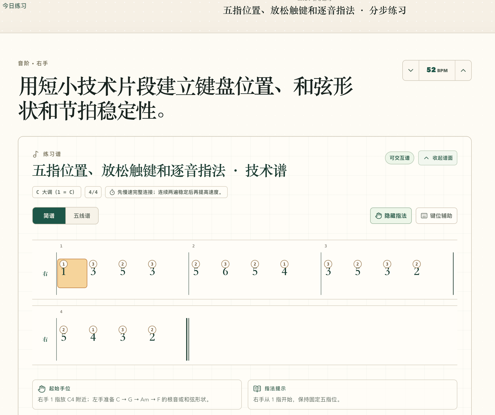

这正是钢琴指法设计最典型的一类题。这种**单旋律、级进为主**的曲子，其实有一套固定的分析方法，而不是每个音都临时决定。

你这段旋律是（C大调）：

```text
1 3 5 3 | 5 6 5 4 | 3 5 3 2 | 5 4 3 2
```

全部都是：

- C大调
- 没有黑键
- 最高到6（A）
- 最低到1（C）
- 总跨度只有六度（C\~A）

所以**完全没必要穿指**。

***

## 方法一：固定手位（推荐初学）

把右手放在：

```text
C D E F G
1 2 3 4 5
```

那么超过5怎么办？

只移动一点点即可。

我会这样配：

| 简谱 | 手指 |
| -- | -- |
| 1  | 1  |
| 3  | 3  |
| 5  | 5  |
| 3  | 3  |

第二小节

```text
5 6 5 4
```

可以有两种方案。

### 方案A（最推荐）

把整个手向右移动一点。

变成

```text
D E F G A

1 2 3 4 5
```

于是：

```text
G A G F

4 5 4 3
```

第三小节：

再回到原来的位置。

```text
E G E D

3 5 3 2
```

第四小节：

```text
G F E D

5 4 3 2
```

整个过程只有一次移动。

这是最自然的。

***

## 方法二：一直不移动（也可以）

还有一种：

一直保持

```text
C D E F G

12345
```

那么：

```text
5
```

就是5指。

然后：

```text
6(A)
```

直接伸小指出去。

于是：

```text
1 3 5 3
1 3 5 3

5 6 5 4
5 5(伸) 5 4

3 5 3 2
3 5 3 2

5 4 3 2
5 4 3 2
```

这种方法：

✔ 不用换手位

但是：

✘ 小指容易紧张。

一般教材不推荐。

***

# 我会怎么设计？

如果这是我编教材。

我会标：

```text
1 3 5 3
1 3 5 3

4 5 4 3
↑
这里整体右移

3 5 3 2
↑
这里整体回来

5 4 3 2
```

只有两次移动。

非常舒服。

***

# 一个更重要的问题

其实你开发钢琴平台，以后**不应该存"指法"。**

应该存：

```json
{
  "handPosition": "C",
  "move": [
    {
      "measure": 2,
      "to": "D"
    },
    {
      "measure": 3,
      "to": "C"
    }
  ]
}
```

因为：

**钢琴真正教的不是："这个音用3指。"\`**

而是：

> **"现在手位在这里。"**

专业老师讲课也是：

> 手放这里。

> 下一句移过去。

> 再回来。

而不是：

> 1、3、5、3、4、5……

***

## 我建议你的平台采用「手位 + 指法」的双层表示

如果你以后做 AI 钢琴学习平台，我建议不要像大多数简谱软件那样，只在每个音上方标一个数字，而是设计成两层：

```text
手位：      C位                 D位              C位
          ↓                   ↓                 ↓

指法：
        1 3 5 3 | 4 5 4 3 | 3 5 3 2 | 5 4 3 2
```

这样学习者能理解**为什么这里要换指**——因为**手位变了**，而不是单纯记忆一串数字。

这也是钢琴教材（如拜厄、汤普森、车尔尼）在训练中真正希望培养的能力：**先建立手位意识，再形成自然的指法。**




我会从**钢琴教学**和**产品设计**两个角度来批判。

先说结论：

> **这套指法作为"让用户弹出来"是合格的；作为"培养钢琴能力"是不合格的。**

这是两个完全不同的目标。

***

# 一、最大的缺点：没有表达"为什么"

例如第一句：

```
1 3 5 3
↓ ↓ ↓ ↓
1 3 2 3
```

用户看到的是：

> 哦，这里要用123……

但是不知道：

为什么5要用2指？

为什么不是5指？

为什么不是4指？

这是最大的问题。

***

## 举例

第二小节：

```
5 6 5 4
2 3 2 1
```

对于老师来说：

这是：

> 手已经移动到了G位置。

但是用户根本不知道。

他只会记：

```
2
3
2
1
```

于是下一首歌：

全部忘了。

因为没有建立：

> 手位（Position）

而是在记：

> 数字。

***

# 二、没有"手位"概念

真正钢琴老师脑子里是：

```
第一小节

C Position

C D E F G

12345
```

第二小节

```
G Position

G A B C D

12345
```

第三小节

```
回C Position
```

而不是：

```
1323

2321

3232
```

所以：

你的平台现在教的是：

> Finger Number

而不是：

> Hand Position

***

# 三、违反了初学教学原则

例如：

第二小节

```
5 6 5 4

2 3 2 1
```

对于新手。

他会：

```
2

↓

3

↓

2

↓

1
```

疯狂数手指。

实际上。

他应该想的是：

```
G

↓

A

↓

G

↓

F
```

整个手根本不用想。

因为已经在G位置。

***

# 四、不能迁移

这是最严重的问题。

假设今天练：

```
1 3 5 3
```

明天：

```
1 2 4 2
```

用户：

重新背。

但是如果学的是：

```
C Position
```

那么：

无论：

```
1353

1242

1543

3123
```

全部都会。

因为：

手位没变。

***

# 五、平台实际上在训练"记忆"

不是训练：

钢琴。

这一点很重要。

***

# 六、没有告诉用户什么时候移动

其实这里只有一次移动。

但是页面完全没体现。

例如可以：

```
────────────

C Position

1 3 5 3

────────────

→ Move to G Position

5 6 5 4

────────────

← Return to C Position

3 5 3 2

5 4 3 2
```

用户马上懂了。

***

# 七、没有颜色表达

现在：

```
①

③

②
```

都是一样颜色。

但是：

真正需要强调的是：

```
C Position

🟢

Move

🟡

Return

🟢
```

用户一眼知道：

什么时候换位置。

什么时候不用。

***

# 八、没有区分"固定指法"和"临时指法"

其实：

```
12345
```

这种。

应该属于：

固定。

例如：

```
C Position

固定：

C D E F G

12345
```

而：

```
2321
```

其实只是：

因为：

已经移动。

它不是：

新的规则。

***

# 九、指法本身，我也有意见

第二小节：

```
5 6 5 4

2 3 2 1
```

如果目标：

是建立：

G Position。

我更喜欢：

```
5 6 5 4

1 2 1 5
```

或者：

```
4 5 4 3
```

为什么？

因为：

保持：

```
G A B C D

12345
```

以后所有教材：

拜厄

汤普森

哈农

车尔尼

都是这样建立位置感。

而不是：

```
2321
```

这种。

虽然：

2321

没有错。

但是：

学习价值不高。

***

# 十、如果这是我设计的平台

我会改成这样。

```
────────────────────────

C Position

C D E F G
1 2 3 4 5

RH

① ③ ⑤ ③

────────────────────────

➡ Move to G Position

G A B C D
1 2 3 4 5

⑤ ⑥ ⑤ ④

────────────────────────

⬅ Return to C Position

③ ⑤ ③ ②

⑤ ④ ③ ②

────────────────────────
```

甚至：

整个背景颜色变。

```
🟩 C Position

🟨 G Position

🟩 C Position
```

用户根本不用记。

看颜色。

就知道：

哦。

现在整只手：

移动了。

***

## 如果站在钢琴教学角度，我给这套设计打分

| 项目      |       分数 | 评价                               |
| ------- | -------: | -------------------------------- |
| 能弹出来    | **9/10** | 指法基本合理，新手照着能完成练习。                |
| 培养指法习惯  | **6/10** | 有具体手指编号，但缺少背后的规律和解释。             |
| 培养手位意识  | **2/10** | 几乎没有体现手位（Position）和移位（Shift）的概念。 |
| 可迁移到新曲子 | **3/10** | 用户容易记住这一首，却难以举一反三。               |
| AI 教学价值 | **4/10** | AI 只能告诉用户“按几指”，却很难解释“为什么这样按”。    |

**我认为，你的平台真正可以做出差异化的地方，不是自动标指法，而是自动解释指法。**

例如在第二小节，点击指法后弹出一个简短说明：

> **为什么这里用 2-3-2-1？**
> 因为这一小节建议将手整体移动到更高的位置，使后续旋律连续、自然，不需要拉伸手指。

这种解释只有一句话，但它是在教**钢琴思维**，而不是让用户背答案。对于初学者来说，这种能力的培养，比单纯显示几个数字更有长期价值。
