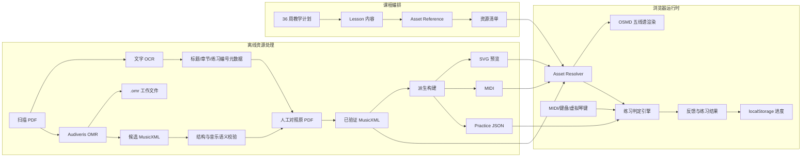

# 练琴簿技术架构文档

## 1. 文档定位

本文档是练琴簿的工程事实来源，统一描述应用架构、课程数据、乐谱资源、OMR 流水线、MusicXML 渲染、MIDI 判定、进度存储和质量门禁。

文档职责如下：

| 文档              | 唯一职责                 |
| --------------- | -------------------- |
| `练琴学习计划.md`     | 教学目标、教材比例、阶段安排和通过标准  |
| `练琴簿_产品需求文档.md` | 用户场景、产品功能、交互行为和验收标准  |
| `练琴簿_技术架构文档.md` | 数据模型、模块边界、资源流水线和工程约束 |

课程和乐谱必须分离。新的长期事实源是数据库中的已发布课程版本与可编辑 `ScoreDocument`；MusicXML 是导入、导出和五线谱交换产物，MIDI、SVG、PDF 和练习事件均为独立资源或派生产物。

## 2. 当前状态

### 2.1 应用现状

当前应用是 React 18、TypeScript 和 Vite 构建的本地优先单页应用：

- 使用 `HashRouter` 提供今日练习、课程路径、沉浸练习和练习记录页面。
- 课程已覆盖全部 6 个阶段、36 周、108 个练习日和 540 个练习项。
- 每个练习日由热身、方法教材、技术、曲目和简谱视奏组成；第 1—8 周方法教材为小汤 1、2，第 9 周以后再进入拜厄。
- 每个练习项都有 `practice_score`；第 1—8 周保留显式教学数据，用于手指编号、固定手位、逐音指法和最小双手；第 9—36 周由逐周课程规格确定性生成具体 `expected_step[]`。
- MIDI、电脑键盘和虚拟琴键统一转换为标准化按键事件。
- 练习进度保存在 `localStorage`，不保存 MIDI 原始事件。

当前代码已经具备后端与 SQLite 基础能力，但课程仍主要由 `src/features/course/data.ts` 在前端构建时生成。后续重构方向是把已发布 `curriculum_revision` 作为课程运行事实源，保留静态课程数据仅作为离线兼容和迁移兜底。

### 2.2 教材数字化现状

以下状态是工作区快照。小汤 1、2 的 OCR、候选 MusicXML、Practice JSON 和 OCR 指法候选已经生成；拜厄、哈农的全量候选 MusicXML 也已生成。后续工作的重点是按教学计划审核、切分、版本化和发布，而不是重复全量 OMR。候选解析产物存在不等于已发布，也不改变第 1—8 周“人工预备谱 + 指法提示”的首发承载方式。

| 资源          | 当前产物                                                                    | 可用范围                  | 风险                                                 |
| ----------- | ----------------------------------------------------------------------- | --------------------- | -------------------------------------------------- |
| 小汤 1 扫描 PDF | 45 页原始 PDF                                                              | 第 1—4 周入门教材核对         | 原始 PDF 只作本地参考，不进入前端构建                              |
| 小汤 1 结构化数据  | 14 份候选 `.musicxml`、13 份 `.practice.json`、10 份 `.fingering.json`、OCR 页文本 | 教材谱库只读核对、来源定位、后续审核    | 乐章 009 暂缺 Practice JSON；OCR 指法只是候选，不能直接写入确认指法或实时判定 |
| 小汤 2 扫描 PDF | 52 页原始 PDF                                                              | 第 5—8 周入门进阶教材核对       | 原始 PDF 只作本地参考，不进入前端构建                              |
| 小汤 2 结构化数据  | 16 份候选 `.musicxml`、16 份 `.practice.json`、15 份 `.fingering.json`、OCR 页文本 | 教材谱库只读核对、来源定位、后续审核    | OCR 指法只是候选，不能直接写入确认指法或实时判定                         |
| 拜厄扫描 PDF    | 102 页原始 PDF                                                             | 原始教材核对                | 无文本层                                               |
| 拜厄 OCR      | `拜厄钢琴基本教程_OCR文本.txt`                                                    | 目录、章节、练习编号和说明文字       | 不能可靠表达五线谱音符                                        |
| 拜厄 OMR 全量任务 | `.omr`、日志和 170 份候选 `.musicxml`                                          | PDF 第 7—102 页的候选检索与审核 | 39 个乐章为单谱表练习或教师声部；尚无人工确认的练习编号映射                    |
| 哈农扫描 PDF    | 119 页原始 PDF                                                             | 原始教材核对                | 无文本层                                               |
| 哈农 OMR 全量任务 | `.omr`、日志和 68 份候选 `.musicxml`                                           | PDF 第 6—119 页的候选检索与审核 | 第 90 页未导出；所有片段仍需人工复核                               |
| 哈农结构化数据     | 68 份 `.musicxml`、`manifest.json`、`segments.jsonl`、`ocr_pages.jsonl`     | 程序和 AI 读取候选数据         | `needs_review`，禁止实时判定                              |

四套候选资源均由 Audiveris 5.11.0 和 ProxyMusic 4.0.3 导出为 MusicXML 4.0.3。当前 268 份 `.musicxml` 已通过 XML 语法校验，且均包含音符节点，但这只说明文件可解析，不代表音乐语义正确。

候选资源的计数不是教材练习编号：

- 拜厄 170 个乐章是 Audiveris 根据版面缩进和系统分出的片段，需按 `索引.md` 的 `source-sheet-N` 页码、教材章节和学生/教师声部选择。
- 哈农 68 个乐章已包含 OCR 与页码关联；第 1—5 条可分别定位到乐章 001—005，但仍需以原 PDF 复核。
- 小汤 1、2 共 30 个候选乐章已进入 `public/materials/` 和简谱目录，但需人工确认曲名、PDF 页码、学生/教师声部、左右手范围、指法和小节范围后，才能绑定正式课程。
- 哈农第 90 页因 Audiveris 内部比较器异常未生成可靠 MusicXML，必须保留纸本练习降级路径。

候选 OMR 日志中已经出现小节节奏不一致、声部时值超出、调号/临时记号/连线关联失败等问题。因此，候选 MusicXML 只能进入检索、审核、来源定位和本地只读核对谱库，不能直接进入播放、练习事件或实时判定。`.fingering.json` 中的 OCR 指法候选只能作为人工校对输入，不能覆盖课程内已确认的逐音指法。

### 2.3 哈农结构化数据

当前哈农数据集位于：

```text
.trae/documents/哈农钢琴练指法_MusicXML/
├── manifest.json       # 数据集和片段摘要
├── segments.jsonl      # 程序/AI 主读取文件，每行一个 score_segment
├── ocr_pages.jsonl     # OCR 页记录
├── schema.json         # 字段契约
├── README.md           # 读取和重新生成说明
└── *.musicxml          # 原始 OMR 候选乐谱
```

`segments.jsonl` 是 OCR 与 MusicXML 的组合读取格式：

```json
{
  "segment_id": "hanon.segment.001",
  "source": {
    "pdf_pages": [6, 7],
    "ocr_page_refs": [6, 7],
    "ocr_context": [{ "pdf_page": 6, "text": "..." }]
  },
  "musicxml": {
    "path": "哈农钢琴练指法_乐章_001.musicxml",
    "sha256": "...",
    "status": "candidate"
  },
  "music": {
    "measure_count": 29,
    "time_signatures": [{ "beats": 2, "beat_type": 4 }],
    "staff_ids": ["1", "2"]
  },
  "quality": {
    "status": "needs_review",
    "realtime_judgement_allowed": false
  },
  "note_events": [
    {
      "event_id": "hanon.segment.001.event.00001",
      "measure_index": 1,
      "onset_beats": 0,
      "duration_beats": 0.25,
      "voice": "5",
      "staff": "2",
      "pitch": { "step": "C", "octave": 3, "midi": 48 }
    }
  ]
}
```

设计约束：

- `segment_id` 代表 OMR 片段，不直接等同教材练习编号。
- `source.pdf_pages` 来自人工整理的 `索引.md`。
- `source.ocr_page_refs` 关联 `ocr_pages.jsonl`。
- `musicxml.sha256` 用于检查 MIDI、SVG 和 Practice JSON 是否来自同一版本。
- `quality.realtime_judgement_allowed` 为 `false` 时，程序只能用于检索、分析和人工审核。
- 只有状态变为 `published` 后，片段才能绑定正式课程。

重新生成命令：

```bash
python3 .trae/scripts/build_hanon_dataset.py
```

### 2.4 拜厄候选 MusicXML

当前拜厄候选资源位于：

```text
.trae/documents/拜厄钢琴基本教程_MusicXML/
├── 索引.md              # MusicXML 乐章与 source-sheet 页码
└── *.musicxml            # 170 份原始 OMR 候选乐谱
```

拜厄目录当前没有与哈农等价的 `manifest.json`、`segments.jsonl` 和规范化音符事件文件。因此，接入课程前必须补齐至少以下人工元数据：

- 教材章节、练习标签、原 PDF 页码和候选乐章路径。
- 学生/教师声部、左手/右手/双手范围。
- 候选乐章是否跨页或包含多个教材练习。
- 审核状态、内容哈希和来源复核记录。

《练琴学习计划》已按最新教学状态定义选材路径：第 1—4 周使用小汤 1，第 5—8 周使用小汤 2，第 9—12 周才进入拜厄 PDF 第 7—17 页；第 13—16 周使用拜厄第 18—30 页，第 17—20 周使用第 31—40 页，后续阶段依次推进至第 90 页，并按需使用第 91—102 页附录。课程服务层不得用 170 个候选乐章的序号代替该路径。

本地应用当前使用 `.trae/scripts/build_material_review_catalog.py` 从小汤 1、2、拜厄和哈农候选数据生成 `public/materials/catalog.json` 以及 `public/materials/{john-thompson-easiest-1,john-thompson-easiest-2,beyer,hanon}/*`。目录只保留乐章摘要、源页、哈希、候选指法引用和审核状态；不复制 PDF、OCR 全文、`.omr`、日志或 `segments.jsonl`。这些文件只能由“教材谱库”按需只读渲染，不能作为正式课程判定输入。

### 2.5 当前代码层架构缺口

当前实现已经满足 36 周静态课程闭环，但与目标后台化架构仍有以下缺口：

1. `src/features/course/data.ts` 仍生成课程、周、练习日和课次，课程顺序、删除、替换和发布不能通过后台完成。
2. `server/database.mjs` 目前只有通用 `content_items`、`content_versions` 和 `material_reviews`，缺少课程层级、课次绑定、乐谱草稿、音符编辑命令和课程发布版本。
3. `src/pages/Admin.tsx` 当前只能上传整份 MusicXML 和 Practice JSON，不能编辑单个音符、指法、起拍、时值或手别。
4. 教材谱库审核记录当前仍保存在浏览器 `localStorage`，需要迁移到服务端 `material_reviews` 或新的 `score_reviews`。
5. 已发布后台内容尚未进入 `Practice`、`CoursePath` 和 `Dashboard` 的课程加载链路。

## 3. 架构目标

1. 支撑 36 周、每周 3 次、每次约 60 分钟的学习计划。
2. 课程正文与乐谱资源彻底分离，通过稳定 ID 和不可变版本引用。
3. 保留 PDF、OCR、OMR 和 MusicXML 的完整来源链路。
4. 数据库中的已发布 `curriculum_revision` 是课程运行事实源；静态课程只作离线兼容。
5. `ScoreDocument` 是内部可编辑规范源；MusicXML 是导入、导出和五线谱交换格式。
6. 只有人工确认过的 `ScoreDocument` 版本才能成为正式课程运行时资源。
7. 同一份已发布 `ScoreDocument` 派生 MusicXML、SVG、MIDI 和 Practice JSON，避免多份手工数据漂移。
8. 同一练习引擎支持 MIDI、电脑键盘和虚拟琴键。
9. OMR 失败、资源未审核或浏览器不支持 MIDI 时，课程仍然可用。

## 4. 核心原则

### 4.1 课程与资源分离

`Lesson` 只组织教学内容和资源引用，不拥有 MusicXML、PDF、音频或视频文件。

```text
CoursePhase
└── CurriculumWeek
    └── PracticeDay
        └── Lesson
            ├── lesson content
            ├── score reference
            ├── audio reference
            └── completion policy
```

### 4.2 OMR 结果默认不可信

Audiveris 导出的 `.omr` 和 `.mxl` 均属于候选产物。只有完成结构校验、音乐语义校验、视觉复核和版本发布后，MusicXML 才能作为正式课程运行时资源加载。候选 MusicXML 可以在本地“教材谱库”中按需只读显示，页面必须显示源页、内容哈希、`needs_review` 状态和“不可实时判定”提示。

### 4.3 规范源与派生产物分离

| 数据                | 角色             | 是否允许手工修改        |
| ----------------- | -------------- | --------------- |
| 原始 PDF            | 证据源            | 否               |
| OCR 文本            | 文字检索辅助         | 可人工校正文字，但不能代替乐谱 |
| `.omr`            | Audiveris 工作文件 | 只在 OMR 工具中修订    |
| 候选 MusicXML       | 机器识别结果         | 可在审核流程中修订       |
| ScoreDocument 草稿  | 内部可编辑规范源       | 通过编辑命令修订        |
| 已发布 ScoreDocument | 规范乐谱版本         | 不可变；修订生成新版本     |
| MusicXML          | 导入、导出和五线谱交换格式  | 不直接手改，重新生成或重新导入 |
| SVG               | 列表预览和缓存        | 否，重新生成          |
| MIDI              | 播放和辅助分析        | 否，重新生成          |
| Practice JSON     | 实时判定事件         | 否，重新生成          |

### 4.4 发布版本不可变

已发布的课程版本和乐谱版本必须具有固定版本号和内容哈希。任何课程顺序、课次内容或谱面修订都生成新版本，已有练习记录继续指向当时使用的 `curriculum_revision_id`、`lesson_id` 和 `score_version_id`。

### 4.5 数据库优先、本地可缓存

课程、课程版本、乐谱版本、审核记录和管理员修改记录优先保存在 SQLite。前端可缓存最后一个已发布课程快照到 IndexedDB 或 `localStorage`，仅用于离线继续学习。资源解析、校验和派生在后端或离线工具中完成，浏览器不运行 OMR。

### 4.6 管理后台只编辑草稿

管理员对课程顺序、课次删除、乐谱音符、指法、时值、起拍、手别和和弦的修改只能落在草稿表中。发布动作必须完成结构校验、音乐语义校验、来源核对和派生产物一致性校验。发布后版本不可变，删除已发布内容只能归档。

## 5. 总体架构



## 6. 目录与产物边界

### 6.1 当前工作区

```text
.trae/
├── pdf/                         # 原始扫描教材，不进入前端构建
├── omr/                         # OMR 工作区、日志和候选导出
└── documents/                   # 产品、教学和架构文档
```

`.trae/omr` 是处理现场，不是可发布资源目录。应用不得通过文件名或绝对路径直接读取其中的文件。

### 6.2 目标内容目录

```text
content/
├── curriculum/
│   └── curriculum.v1.json
├── lessons/
│   └── lesson_id.md
└── assets/
    └── score_id/
        ├── manifest.json
        ├── source/
        │   └── provenance.json
        ├── versions/
        │   └── v1/
        │       └── score.musicxml
        └── derived/
            └── v1/
                ├── preview.svg
                ├── playback.mid
                └── practice.json
```

正式课程构建阶段只把 `published` 状态的资源复制到正式静态目录。当前本地开发包额外包含 `public/materials/` 的核对目录：其中仅有候选 MusicXML 与最小化目录摘要，且只允许“教材谱库”读取；原始 PDF、OCR 全文、`.omr`、日志和 `segments.jsonl` 均不进入浏览器产物。候选资源不得被练习引擎、播放或实时判定模块引用。

## 7. 资源模型

### 7.0 数据库课程与乐谱核心表

数据库驱动版本使用以下核心表。命名保持 snake\_case，所有可发布对象都使用不可变版本：

| 表                       | 职责                                       |
| ----------------------- | ---------------------------------------- |
| `curriculums`           | 课程集合，例如默认 36 周课程；记录当前已发布版本               |
| `curriculum_revisions`  | 课程版本；草稿、已发布和归档状态                         |
| `curriculum_nodes`      | 阶段、周、练习日、练习项的树形结构；通过 `position` 排序       |
| `lesson_score_bindings` | 练习项与乐谱版本的绑定，支持主谱、参考谱和跟弹事件                |
| `scores`                | 乐谱逻辑实体，例如某首曲目或某个教材片段                     |
| `score_versions`        | 已发布或待审核的不可变乐谱版本，保存 `ScoreDocument` 和派生产物 |
| `score_drafts`          | 管理员编辑中的乐谱草稿                              |
| `score_edit_events`     | 音符级编辑命令审计，例如改音高、指法、时值、手别                 |

课程树使用统一节点模型：

```ts
type curriculum_node_kind = "stage" | "week" | "practice_day" | "lesson";

interface curriculum_node {
  id: string;
  revision_id: string;
  parent_id?: string;
  kind: curriculum_node_kind;
  title: string;
  position: number;
  status: "active" | "archived";
  payload: Record<string, unknown>;
}
```

练习记录必须保存：

```ts
interface practice_version_ref {
  curriculum_revision_id: string;
  lesson_id: string;
  score_version_id?: string;
}
```

这样后台调整顺序、删除课次或替换谱面时，不会破坏历史记录。

### 7.0.1 ScoreDocument

`ScoreDocument` 是内部编辑规范源。它比 Render AST 更接近音乐语义，比 MusicXML 更适合做局部编辑。

```ts
interface score_document {
  schema_version: 1;
  id: string;
  title: string;
  key_signature: string;
  tonic_midi: number;
  time_signature: string;
  measures: score_measure[];
}

interface score_measure {
  id: string;
  number: string;
  meter: { beats: number; beat_unit: number };
  events: score_event[];
}

interface score_event {
  id: string;
  onset_beats: number;
  duration_beats: number;
  hand: "left" | "right";
  voice: number;
  notes: score_note[];
  chord?: string;
}

interface score_note {
  id: string;
  midi: number;
  finger?: 1 | 2 | 3 | 4 | 5;
  tie?: "start" | "continue" | "stop";
}
```

管理员曲谱校对通过命令修改 `ScoreDocument`：

```ts
type score_edit_command =
  | { type: "set_note_pitch"; event_id: string; note_id: string; midi: number }
  | { type: "set_fingering"; event_id: string; note_id: string; finger?: 1 | 2 | 3 | 4 | 5 }
  | { type: "set_event_time"; event_id: string; onset_beats: number; duration_beats: number }
  | { type: "set_event_hand"; event_id: string; hand: "left" | "right" }
  | { type: "set_chord"; event_id: string; chord?: string };
```

所有命令必须写入 `score_edit_events`，并在保存后重新运行小节时值、音域、指法范围和左右手事件校验。

### 7.1 通用资源

```ts
type asset_type =
  | "score"
  | "audio"
  | "video"
  | "image"
  | "pdf"
  | "text";

type rights_status =
  | "unknown"
  | "private_reference"
  | "public_domain"
  | "licensed";

interface asset {
  id: string;
  type: asset_type;
  title: string;
  rights_status: rights_status;
  current_version_id?: string;
  created_at: string;
  updated_at: string;
}
```

### 7.2 乐谱版本

```ts
type score_version_status =
  | "candidate"
  | "validation_failed"
  | "needs_review"
  | "verified"
  | "published"
  | "rejected";

interface score_version {
  id: string;
  asset_id: string;
  version: number;
  status: score_version_status;
  musicxml_path: string;
  content_sha256: string;
  source_document_id: string;
  source_page_start: number;
  source_page_end: number;
  source_exercise_label?: string;
  omr_job_id?: string;
  validation_report_id: string;
  verified_by?: string;
  verified_at?: string;
}
```

### 7.3 OMR 任务

```ts
type omr_job_status =
  | "queued"
  | "processing"
  | "exported"
  | "failed"
  | "cancelled";

interface omr_job {
  id: string;
  source_document_id: string;
  page_start: number;
  page_end: number;
  engine: "audiveris";
  engine_version: string;
  status: omr_job_status;
  omr_path?: string;
  candidate_musicxml_path?: string;
  log_path: string;
  started_at: string;
  completed_at?: string;
}
```

### 7.4 课程资源引用

课程不保存本地绝对路径，只保存稳定资源 ID、版本策略和使用范围。

```ts
type asset_role =
  | "primary_score"
  | "reference_pdf"
  | "preview"
  | "demonstration_audio"
  | "practice_events";

interface lesson_asset_reference {
  asset_id: string;
  role: asset_role;
  version_policy: "published" | "pinned";
  pinned_version_id?: string;
  measure_start?: number;
  measure_end?: number;
  hand_filter?: "right" | "left" | "both";
  transpose_semitones?: number;
  tempo_override?: number;
}
```

## 8. 课程模型

课程层级保持：

```text
curriculum_plan
└── course_phase
    └── curriculum_week
        └── practice_day
            └── lesson
```

`lesson` 从直接持有所有音符数据，逐步迁移为“教学内容 + 资源引用 + 完成策略”。

```ts
type practice_mode =
  | "guided_score"
  | "timed_reading"
  | "manual_checklist";

interface lesson {
  id: string;
  course_id: string;
  week_number: number;
  day_index: 1 | 2 | 3;
  title: string;
  objective: string;
  guidance: string;
  practice_mode: practice_mode;
  estimated_minutes: number;
  target_bpm?: number;
  pass_accuracy?: number;
  asset_references: lesson_asset_reference[];
}
```

每个 `lesson` 还必须持有可显示的 `practice_score`。它确保手动教材和视奏项目不会退化为纯文字页面：

```ts
interface practice_score {
  id: string;
  title: string;
  key_signature: string;
  time_signature: string;
  beats_per_measure: number;
  tempo_hint: string;
  start_position: string;
  finger_hint: string;
  source: {
    kind: "inline" | "reference" | "musicxml";
    status: "published" | "reference_only" | "needs_review" | "awaiting_import";
    label: string;
    asset_id?: string;
    excerpts?: Array<{
      asset_id: string;
      label: string;
      measure_start?: number;
      measure_end?: number;
    }>;
  };
  steps: expected_step[];
  fingering_guide: {
    preparation: string[];
    actions: string[];
    success_checks: string[];
    common_mistakes: string[];
    position_strategy: string[];
    fingering_rules: string[];
    self_check: string[];
    position_map: Array<{
      label: string;
      start_note: string;
      notes: string[];
      fingers: string[];
      applies_to: string;
      reason: string;
      movement?: "stay" | "move" | "return";
    }>;
  };
  technique_alerts?: Array<{
    kind: "contract" | "extend" | "thumb_under" | "finger_over" | "finger_substitution";
    label: "缩指" | "扩指" | "穿指" | "跨指" | "换指";
    measure_index?: number;
    step_id?: string;
    hand?: "right" | "left" | "both";
    note: string;
  }>;
}
```

- `guided_input`：`practice_score.steps` 和判定使用的 `expected_step[]` 指向本次完整谱面。
- `timed_reading`：`practice_score` 是用户要直接视奏的具体新谱，不参与逐音判定。
- `manual_checklist`：显示配套预备谱、起始手位、逐音指法、特殊指法动作、指法判断依据和原教材接入状态；小汤 1、2 当前以该模式承载，候选 MusicXML 和 `.fingering.json` 只作为教材谱库核对输入，待教材 MusicXML 通过审核并发布后再用 `asset_id` 替换。
- `source.excerpts`：同一纸本学生页被 OMR 拆成多个乐章时，按数组顺序加载、校验哈希、合并判定事件并连续编号；不能只消费第一个乐章。
- `technique_alerts`：用于在课程、谱面和练习记录中突出缩指、扩指、穿指、跨指和换指；这些动作不能只写进普通说明文字。

在迁移完成前，原创教学片段和小汤入门预备谱仍可保留内联 `expected_step[]`。内联数据仅用于短小、自有、可人工核对的练习、逐音指法提示、指法判断依据和特殊指法动作提示，不用于承载整本拜厄或哈农。

## 9. OMR 流水线

### 9.1 处理步骤

1. **登记原始文档**：记录文件哈希、页数、来源、权利状态和导入时间。
2. **文字 OCR**：只提取目录、章节、练习编号和说明文字。
3. **页面切分**：按练习而不是按整本书建立处理单元，记录 PDF 页码和练习编号。
4. **Audiveris 识别**：生成 `.omr` 工作文件和候选 `.mxl`。
5. **解包与规范化**：提取 MusicXML，统一编码和文件命名，不改变音乐语义。
6. **自动校验**：执行 XML、结构、节奏、音域、谱表和来源检查。
7. **人工复核**：将 MusicXML 渲染结果与原 PDF 并排核对。
8. **版本发布**：审核通过后生成不可变版本和内容哈希。
9. **派生产物**：生成 SVG、MIDI 和 Practice JSON。
10. **课程绑定**：Lesson 只绑定已发布版本或 `published` 版本策略。

### 9.2 为什么必须按练习切分

当前全量导出证明一页 PDF 可对应一个、多个或跨页的 MusicXML 乐章。例如，拜厄候选乐章可能覆盖连续数页，哈农第 1 条覆盖 PDF 第 6—7 页；反过来，一页也可能被拆成多个候选乐章。课程需要引用“哈农第 1 条”或某个小节范围，而不是笼统引用某页或某个 OMR 乐章序号。

切分清单至少记录：

```ts
interface score_segment {
  id: string;
  source_document_id: string;
  source_page_start: number;
  source_page_end: number;
  exercise_label: string;
  crop_region?: {
    x: number;
    y: number;
    width: number;
    height: number;
  };
}
```

### 9.3 自动校验

#### 结构校验

- MusicXML 可被 XML 解析器读取。
- 根节点和版本合法。
- `part-list` 与实际 `part` 一致。
- 小节编号可排序。
- 谱表、谱号、调号和拍号存在或能正确继承。

#### 音乐语义校验

- 每个声部在小节内的时值总和符合拍号。
- `backup`、`forward` 和 voice 的时间位置不会产生负值或越界。
- 连音、延音、附点、临时记号和跨小节 tie 成对。
- 钢琴谱的左右手谱表、音域和声部数量在合理范围内。
- 同一拍的音符可以稳定转换为和弦事件。

#### 来源一致性

- MusicXML 内记录源 PDF 和页码。
- 资源清单记录 Audiveris 版本、日志和 `.omr` 路径。
- 候选文件哈希可复现。
- OCR 提取的练习编号与人工登记编号一致。

### 9.4 发布门禁

| 状态                  | 可显示预览 | 可播放 | 可实时判定 | 可绑定正式课程 |
| ------------------- | ----- | --- | ----- | ------- |
| `candidate`         | 仅审核界面 | 否   | 否     | 否       |
| `validation_failed` | 仅审核界面 | 否   | 否     | 否       |
| `needs_review`      | 仅审核界面 | 可选  | 否     | 否       |
| `verified`          | 是     | 是   | 测试环境  | 否       |
| `published`         | 是     | 是   | 是     | 是       |
| `rejected`          | 否     | 否   | 否     | 否       |

当资源尚未发布时，课程必须回退到 `manual_checklist` 或 `timed_reading`，不得使用未经核对的音符给用户判错。

### 9.4.1 本地审核门禁实现

教材谱库将生成的 `catalog.json` 视为只读输入，并把本地审核记录保存到 `localStorage` 的 `lianqinbu.material-review-gates.v1`：

```ts
interface material_review_record {
  segment_id: string;
  content_sha256: string;
  status: score_version_status;
  checks: {
    structure_checked: boolean;
    music_semantics_checked: boolean;
    visual_pdf_checked: boolean;
    source_mapping_checked: boolean;
  };
  note: string;
  updated_at: string;
  history: Array<{
    from_status: score_version_status;
    to_status: score_version_status;
    changed_at: string;
    note: string;
  }>;
}
```

约束如下：

1. 本地记录仅在 `content_sha256` 与当前 MusicXML 一致时覆盖目录状态；内容改变后旧记录自动失效。
2. 状态按 `candidate → needs_review → verified → published` 主路径流转；失败、拒绝和重新审核使用受限回退路径。
3. 进入 `verified` 必须完成结构、音乐语义、视觉和来源四项审核证据，并留下审核结论。
4. 进入 `published` 还必须检查 SVG、MIDI 和 Practice JSON 均来自相同哈希；状态按钮本身不会生成这些派生产物。
5. 当前候选资源没有可用的同版本 Practice JSON，因此本地页面只能更新审核状态，不会把现有 `manual_checklist` 自动改为实时判定。

## 10. MusicXML 渲染和派生

### 10.1 乐谱渲染

目标链路：

```text
published ScoreDocument
→ Asset Resolver
→ Render AST
→ OpenSheetMusicDisplay
→ SVG DOM
```

OSMD 用于课程详情、沉浸练习页和本地教材谱库，支持双手钢琴谱、连线、力度、指法和分页。列表页不批量实时渲染 MusicXML，而使用构建阶段生成的 SVG 预览。教材谱库按需动态加载 OSMD 与选中片段，避免影响首次进入课程的包体积。

当前 `PracticeScore` 已基于 `practice_score.steps` 提供两种结构化视图：

- 默认连续简谱：按小节和左右手排版，直接显示调性、拍号、简谱数字、延音和和弦。
- 五线谱辅助：从同一份 `expected_step[]` 生成双谱表 SVG，供简谱用户交叉核对。
- 键位辅助：需要时再显示 MIDI 音名，不进入默认谱面。
- 指法辅助：第 1—8 周必须能突出显示手指编号、起始手位、手位地图、逐音指法和判断依据，帮助用户从小汤 1、2 过渡到拜厄。判断依据必须解释调性、主音、音域跨度、五指位置、黑键避拇指、旋律强指和下一句预留手指。UI 必须采用“手位 + 指法”的双层表示，例如 `C Position -> Move to G Position -> Return to C Position`。
- 特殊指法提示：当 `practice_score.technique_alerts` 包含缩指、扩指、穿指、跨指或换指时，谱面上方显示动作标签，相关小节或音位显示提醒。

当前项目已安装 OSMD。迁移期 `PracticeScore` 仍以课程中的 `expected_step[]` 呈现全部 36 周练习；候选教材谱由 `MaterialScoreViewer` 在教材谱库只读渲染，小汤 1、2 的候选指法文件只允许显示为待校对辅助。数据库课程接入后，`PracticeScore` 应从 `ScoreDocument` 派生的 Render AST、Practice JSON 或已发布 MusicXML 读取谱面；`NotationStrip` 不再作为主谱面。

### 10.2 播放

MIDI 是已发布 `ScoreDocument` 的派生产物，必要时可通过 MusicXML 交换格式间接生成，主要用于：

- 示范播放。
- 播放光标同步。
- 单手静音或独奏。
- 速度调整。
- 后续 AI 陪练。

MIDI 不作为乐谱展示的规范源，也不能反向覆盖 `ScoreDocument` 或 MusicXML。

### 10.3 实时判定事件

已发布 `ScoreDocument` 经过规范化解析后生成 `practice.json`。从 MusicXML 导入的谱面必须先转换为 `ScoreDocument` 草稿，审核发布后再派生判定事件：

```ts
interface expected_event {
  id: string;
  measure_index: number;
  beat_offset: number;
  duration_beats: number;
  midi_notes: number[];
  hand: "right" | "left" | "both";
  voice_ids: string[];
  tie_start: boolean;
  tie_stop: boolean;
}
```

`practice.json` 与 `score_version_id` 绑定，并保存 `ScoreDocument` 内容哈希。哈希不一致时必须重新生成，禁止继续使用旧判定事件。

### 10.4 PDF

原始教材 PDF 只用于私有核对。若需要打印或下载，应从已发布 `ScoreDocument` 或其 MusicXML 导出生成独立 PDF，并单独检查版权和授权状态。

## 11. 运行时模块

| 模块                      | 职责                                             | 约束                                    |
| ----------------------- | ---------------------------------------------- | ------------------------------------- |
| `features/curriculum`   | 从 API 读取课程版本、阶段、周、练习日和 Lesson                  | 不生成长期课程事实源                            |
| `features/course`       | 静态课程兼容层和迁移兜底                                   | 不再新增长期业务规则                            |
| `features/assets`       | 资源清单、版本解析、状态校验和只读教材谱加载                         | 只返回 `published` 资源给正式课程；候选资源只可供教材谱库核对 |
| `features/score`        | ScoreDocument、MusicXML、Render AST、OSMD 渲染和光标同步 | 不包含课程解锁规则                             |
| `features/score-editor` | 管理员音符、指法、起拍、时值和手别编辑                            | 只修改草稿，不直接发布                           |
| `features/practice`     | 会话状态机、节拍推进、判定和统计                               | 只消费规范化事件                              |
| `features/midi`         | 权限、设备、`note_on` 和 `note_off`                   | 不读取课程数据                               |
| `features/audio`        | 节拍器、提示音和 MIDI 播放                               | 不修改进度                                 |
| `features/progress`     | 进度、迁移、损坏回退                                     | 不保存原始 MIDI 事件                         |
| `features/feedback`     | 错误分类和下一步建议                                     | 不修改乐谱资源                               |

当前 `src/features/course/data.ts` 包含 36 周静态课程编排、逐周规格和音符生成器。它只能作为迁移兜底。长期运行时必须从 `/api/v1/curriculums/active` 读取已发布课程版本，并用 `lesson_score_bindings` 解析课次谱面。课程容量门禁要求曲目/视奏标题小节数与结构化谱面实际小节数一致；第 29—36 周曲目和视奏必须包含持续左手伴奏。

## 12. 练习判定

### 12.1 输入事件

```ts
interface note_event {
  source: "midi" | "keyboard" | "virtual_piano";
  type: "note_on" | "note_off";
  note: number;
  velocity: number;
  timestamp: number;
}
```

输入适配器只负责标准化。练习引擎不读取 MIDI 端口、DOM 键盘事件或虚拟琴键组件。

### 12.2 判定规则

- 单音必须匹配目标音高。
- 和弦在同一时间窗口内收集全部目标音。
- 初期窗口默认为目标拍前 250ms、后 500ms。
- 延音和连音根据 MusicXML tie 语义处理，不能把延续音重复判错。
- grace note、trill 等尚未支持的元素必须在资源清单中声明能力降级。
- 错音记录反馈但不立即终止整段。
- 通过标准由 Lesson 或周计划配置，不写死在组件内。

### 12.3 乐谱光标

显示光标、播放光标和判定光标必须使用同一 `expected_event.id` 或小节拍点标识，避免三个时间轴各自计算后漂移。

## 13. 页面数据流

```text
route
→ load curriculum
→ resolve lesson asset references
→ reject non-published score versions
→ load MusicXML / SVG / practice JSON
→ create practice session
→ normalize user input
→ judge expected events
→ produce practice result
→ update local progress
```

资源不可用时：

```text
asset missing or not published
→ show actionable status
→ switch to manual checklist or timed reading
→ preserve lesson availability
→ do not perform note-level judgement
```

## 14. 存储策略

### 14.1 当前阶段

- SQLite 保存用户、练习记录、内容版本、课程版本、乐谱草稿和审核记录。
- 已发布课程通过 API 返回；前端可缓存最近一次成功读取的课程快照。
- 用户进度本地优先保存在 `localStorage`，登录后同步到 `user_snapshots`。
- 教材候选目录 `public/materials/catalog.json` 只作迁移期核对输入。
- `.trae/pdf` 和 `.trae/omr` 只存在于开发工作区。
- 不上传 MIDI 设备名、原始按键事件或音频。

### 14.2 发布与缓存

- 已发布课程版本、乐谱版本和派生产物不可变。
- 后台发布 API 只返回 `published` 版本给普通用户。
- 管理员可读取草稿和未发布版本，但必须通过审核门禁发布。
- 本地开发、离线模式和正式服务端使用同一 DTO，不为静态模式另造数据模型。

## 15. 版权和数据治理

- 原始教材扫描件默认标记为 `private_reference`，不进入前端构建。
- OCR 文本和 OMR 产物继承原始文档的权利状态。
- 公版作品与具体教材版式、指法、编配的权利状态必须分开判断。
- 每个资源记录来源、页码、练习编号、处理工具和内容哈希。
- 不确定权利状态时只能用于本地学习和核对，不提供公开下载。

## 16. 失败处理

| 失败场景               | 处理                                               |
| ------------------ | ------------------------------------------------ |
| Audiveris 中途停止     | 保留 `.omr` 和日志，从未完成页继续，不发布部分结果                    |
| 已完成全量导出但单页无可靠候选    | 保留原 PDF、OCR 和 `.omr`；在资源清单标记缺页并回退手动练习，例如哈农第 90 页 |
| MusicXML XML 不合法   | 标记 `validation_failed`                           |
| 小节时值不一致            | 标记 `needs_review`，禁止实时判定                         |
| OCR 无法识别标题         | 使用人工元数据，不阻断音符审核                                  |
| OSMD 渲染失败          | 回退 SVG；SVG 也不可用时显示手动模式                           |
| Practice JSON 哈希过期 | 阻止加载并重新生成                                        |
| MIDI 权限拒绝          | 使用电脑键盘和虚拟琴键                                      |
| 本地进度损坏             | 回退默认进度并提示恢复                                      |

## 17. 测试和质量要求

### 17.1 资源流水线

- XML 可解析和 MusicXML 根版本校验。
- 小节时值、voice 时间线和谱表数量校验。
- MusicXML 到 MIDI、SVG 和 Practice JSON 的确定性测试。
- 派生产物记录并验证源 MusicXML 哈希。
- `candidate` 和 `needs_review` 资源不能进入正式课程。
- 本地审核记录必须绑定 MusicXML 哈希；哈希变化后旧状态与历史不得覆盖新版本。
- `verified` 和 `published` 状态转换必须验证审核证据；`published` 还必须验证同哈希 SVG、MIDI 和 Practice JSON。
- 原始 PDF 和 `.omr` 不得出现在前端构建产物。
- 候选清单必须记录来源页覆盖：拜厄 170 个候选乐章覆盖 PDF 第 7—102 页；哈农 68 个候选乐章覆盖第 6—119 页但明确排除第 90 页。
- 拜厄候选乐章必须在进入课程前确认学生/教师声部和手别；哈农第 1—5 条必须复核乐章 001—005 与原 PDF 的对应关系。

### 17.2 课程

- 6 阶段和周次连续。
- 每周 3 个练习日。
- 每日总时长约 60 分钟。
- 第 1—8 周方法教材必须使用小汤 1、2 入门路线，不得生成拜厄整页强任务。
- 含缩指、扩指、穿指、跨指或换指的 Lesson 必须提供 `technique_alerts`，并在 UI 中可见。
- 第 1—12 周默认不生成哈农练习。
- 第 13 周起哈农单项不超过 5 分钟，且必须可被用户跳过。
- Lesson 引用的资源 ID 必须存在。

### 17.3 练习

- MIDI、电脑键盘和虚拟琴键得到一致判定。
- 单音、和弦、延音和跨小节 tie 正确。
- 提前、稳定、滞后、错音和漏音分类正确。
- 资源版本升级不会破坏历史练习记录。

### 17.4 浏览器

- OSMD 可渲染目标双手谱例。
- SVG 回退可用。
- MIDI 断连和重新连接可恢复。
- 键盘导航、可见焦点和减少动效可用。
- 刷新后本地进度保留。

## 18. 分阶段迁移

### 阶段 A：建立数据库事实源

- 新增课程版本、课程节点、课次谱面绑定、乐谱版本、乐谱草稿和编辑事件表。
- 提供 `/api/v1/curriculums/active` 和管理员课程节点管理 API。
- 前端优先读取已发布课程版本，失败时才回退静态 `data.ts`。

### 阶段 B：建立 ScoreDocument 编辑闭环

- 把 MusicXML 或现有 PracticeScore 转为 `ScoreDocument` 草稿。
- 后台提供音符、指法、起拍、时值、手别和和弦编辑。
- 保存草稿后立即返回校验结果和预览数据。

### 阶段 C：发布乐谱与课程版本

- 乐谱草稿通过校验后发布为不可变 `score_version`。
- 课程草稿通过容量、引用、顺序和资源门禁校验后发布为不可变 `curriculum_revision`。
- 练习记录保存课程版本与乐谱版本引用。

### 阶段 D：迁移静态课程

- 将当前 36 周静态课程导入数据库草稿。
- 管理后台支持调整顺序、删除或归档课次、替换谱面。
- 静态 `data.ts` 降级为测试夹具和离线兜底，业务页面不再直接依赖它。

## 19. 当前决策总结

1. 保留学习计划、产品需求和技术架构三份主文档。
2. `ScoreDocument` 是内部可编辑规范源；MusicXML 是导入、导出和五线谱交换格式，不是 OMR 原始输出的同义词。
3. `.trae/omr` 是工作区，不能被浏览器直接消费。
4. OCR 只负责文字和索引，不能用于音符判定。
5. 未发布乐谱必须降级为手动练习，不能给用户错误判定。
6. 小汤 1、2 是当前第 1—8 周的教学入口，优先服务手指编号、固定手位和逐音指法；拜厄从第 9 周后衔接。
7. 课程运行事实源迁移为数据库中的已发布 `curriculum_revision`；静态课程只作离线兼容。
8. 管理后台只能编辑草稿，发布后版本不可变。
9. 当前工作区已有小汤 1/2 共 30 个、拜厄 170 个、哈农 68 个候选 MusicXML；它们是审核输入和课程来源定位，不是可直接运行的正式乐谱。

